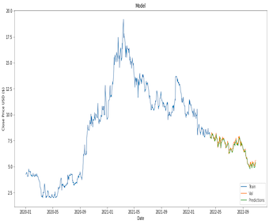
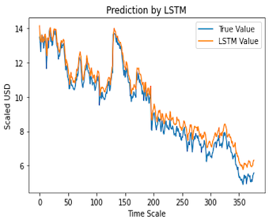

# Stock Price Prediction using LSTM for TCS.NSE

## Overview
This project focuses on predicting the stock prices of Tata Consultancy Services (TCS) listed on the National Stock Exchange (NSE) in India. The project leverages the power of Long Short-Term Memory (LSTM) neural networks to model and predict stock prices based on historical data.

## Dataset
The dataset is sourced from the NSE Nifty50 dataset on Kaggle, which consists of the top 50 companies in India based on their market capitalization. This project specifically works with the stock data for TCS.NSE.

## Requirements
- Python 3.x
- pandas
- numpy
- matplotlib
- keras
- TensorFlow
- scikit-learn
- yfinance

## Installation
```bash
pip install pandas numpy matplotlib keras tensorflow scikit-learn yfinance
```

## Models
Two primary LSTM models are implemented:
1. **Model 1**: Predicts stock prices based on the closing price history.
2. **Model 2**: Uses several features to predict the Adjusted Close Price.

## Key Insights and Analysis
- Performed an exploratory data analysis to understand the trends and patterns in the stock data.
- Computed technical indicators to enhance the dataset and improve model predictions.
- Compared TCS's performance with the broader Nifty50 index.
- Decomposed the time series to analyze trend, seasonality, and residuals.

## Visualizations
Visualizations are provided for:
- Stock price trend over time

- Actual vs. Predicted prices for validation data


## Results
The performance of the models is evaluated using the Root Mean Square Error (RMSE). Both models provide competitive results, with potential for further optimization and tuning.

## License
[MIT](https://choosealicense.com/licenses/mit/)

---

You can further customize the README to better align with your project specifics.